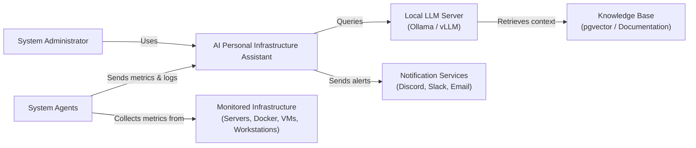

# C4 Model – Context Diagram: AI Personal Infrastructure Assistant

## 1. Person (Actor)
### System Administrator
The primary user of the system. The administrator monitors infrastructure, reviews system health, asks questions in natural language, and approves AI-generated recommendations through the web dashboard.

## 2. System (System Under Development)
### AI Personal Infrastructure Assistant
An intelligent infrastructure management platform that collects system metrics, analyzes infrastructure health using a local Large Language Model (LLM), stores historical data, and provides monitoring, diagnostics, and AI-powered recommendations through a web dashboard.

## 3. External Systems
*   **System Agents**: Lightweight agents installed on monitored machines. They collect system metrics, logs, Docker information, network status, and hardware health, then securely send this data to the backend.
*   **Local LLM Server (Ollama / vLLM)**: A dedicated AI inference server running open-source language models locally. It processes user queries, performs reasoning with Retrieval-Augmented Generation (RAG), and generates infrastructure explanations and recommendations.
*   **Knowledge Base (RAG)**: A vector database containing technical documentation, configuration guides, and indexed system knowledge used by the LLM to generate accurate responses.
*   **Monitored Infrastructure**: Servers, Docker containers, virtual machines, workstations, and network devices managed and monitored by the system.
*   **Notification Services**: External services such as Discord, Slack, or Email used to deliver alerts and system notifications.

## 4. Relationships
| From | Action | To |
| :--- | :--- | :--- |
| **System Administrator** | interacts with | **AI Personal Infrastructure Assistant** |
| **System Agents** | collect telemetry from | **Monitored Infrastructure** |
| **System Agents** | send metrics and logs to | **AI Personal Infrastructure Assistant** |
| **AI Personal Infrastructure Assistant** | queries | **Local LLM Server** |
| **Local LLM Server** | retrieves information from | **Knowledge Base (RAG)** |
| **AI Personal Infrastructure Assistant** | stores/retrieves data from | **Internal Database** |
| **AI Personal Infrastructure Assistant** | sends alerts to | **Notification Services** |

# C4 Model – Context Diagram: AI Personal Infrastructure Assistant

## 1. Person (Actor)
### System Administrator
The primary user of the system. The administrator monitors infrastructure, reviews system health, asks questions in natural language, and approves AI-generated recommendations through the web dashboard.

## 2. System (System Under Development)
### AI Personal Infrastructure Assistant
An intelligent infrastructure management platform that collects system metrics, analyzes infrastructure health using a local Large Language Model (LLM), stores historical data, and provides monitoring, diagnostics, and AI-powered recommendations through a web dashboard.

## 3. External Systems
*   **System Agents**: Lightweight agents installed on monitored machines. They collect system metrics, logs, Docker information, network status, and hardware health, then securely send this data to the backend.
*   **Local LLM Server (Ollama / vLLM)**: A dedicated AI inference server running open-source language models locally. It processes user queries, performs reasoning with Retrieval-Augmented Generation (RAG), and generates infrastructure explanations and recommendations.
*   **Knowledge Base (RAG)**: A vector database containing technical documentation, configuration guides, and indexed system knowledge used by the LLM to generate accurate responses.
*   **Monitored Infrastructure**: Servers, Docker containers, virtual machines, workstations, and network devices managed and monitored by the system.
*   **Notification Services**: External services such as Discord, Slack, or Email used to deliver alerts and system notifications.

## 4. Relationships
| From | Action | To |
| :--- | :--- | :--- |
| **System Administrator** | interacts with | **AI Personal Infrastructure Assistant** |
| **System Agents** | collect telemetry from | **Monitored Infrastructure** |
| **System Agents** | send metrics and logs to | **AI Personal Infrastructure Assistant** |
| **AI Personal Infrastructure Assistant** | queries | **Local LLM Server** |
| **Local LLM Server** | retrieves information from | **Knowledge Base (RAG)** |
| **AI Personal Infrastructure Assistant** | stores/retrieves data from | **Internal Database** |
| **AI Personal Infrastructure Assistant** | sends alerts to | **Notification Services** |

## 5. Context Diagram (Mermaid)

    